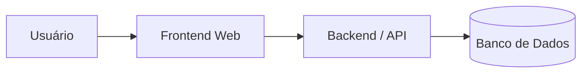

# tasko

Aplicação web de produtividade voltada para organização de projetos, gerenciamento de tarefas e acompanhamento de períodos de foco. O sistema permite que usuários organizem suas atividades em projetos, definam prioridades e acompanhem seu progresso. As tarefas podem ser executadas através de sessões de foco baseadas na técnica Pomodoro, cujos dados são utilizados para gerar métricas de produtividade. Dessa forma, o sistema busca integrar planejamento, execução e análise em uma única plataforma.

## Funcionalidades

* Criação e gerenciamento de projetos
* Criação e gerenciamento de tarefas
* Definição de prioridades e prazos
* Sessões de foco utilizando a técnica Pomodoro
* Registro automático do tempo de foco
* Dashboard com métricas de produtividade
* Histórico de atividades
* Definição e acompanhamento de metas

## Histórias de Usuário

### HU01 — Criar projeto

Como usuário, quero criar projetos com nome, categoria, descrição e prazo para organizar diferentes objetivos e atividades.

### HU02 — Gerenciar tarefas

Como usuário, quero criar, editar, concluir e excluir tarefas dentro de um projeto para acompanhar minhas atividades.

### HU03 — Priorizar tarefas

Como usuário, quero definir a prioridade de minhas tarefas para identificar quais atividades devem receber mais atenção.

### HU04 — Executar Pomodoro

Como usuário, quero iniciar e finalizar sessões Pomodoro  associadas a uma tarefa para controlar meus períodos de foco, com tempos

### HU05 — Registrar produtividade

Como usuário, quero que minhas sessões de foco sejam registradas automaticamente para acompanhar quanto tempo dedico às minhas atividades.

### HU06 — Visualizar dashboard

Como usuário, quero visualizar um dashboard com minhas principais métricas de produtividade para acompanhar meu desempenho. As métricas devem ir desde quantidade de tempo estudado na semana até uma visualização da distribuição de tempo em cada projeto.

### HU07 — Consultar histórico

Como usuário, quero consultar meu histórico de sessões, tarefas concluídas, projetos finalizados.

### HU08 — Definir metas

Como usuário, quero definir metas de produtividade e acompanhar meu progresso para manter uma rotina de estudos ou trabalho consistente.

## Tecnologias

### Frontend

* React

### Backend

* [A definir]

### Banco de Dados

* PostgreSQL

### Ferramentas de IA

* [A definir]

## Equipe

| Membro | Papel      |
| ------ | ---------- |
| Brisa Nascimento | Full Stack |
| Luiz Gustavo | Backend    |
| Leonardo Mendes | Frontend   |
| Arthur Faria | Backend |

## Arquitetura

O sistema será desenvolvido seguindo uma arquitetura web composta por um frontend responsável pela interface do usuário e um backend responsável pela API e pela persistência dos dados em banco de dados.

## Possíveis extensões

* Notificações
* Tarefas recorrentes
* Calendário
* Tags
* Gamificação
* Streaks de produtividade
* Integração com calendário externo
* Recomendações personalizadas de estudo e trabalho
